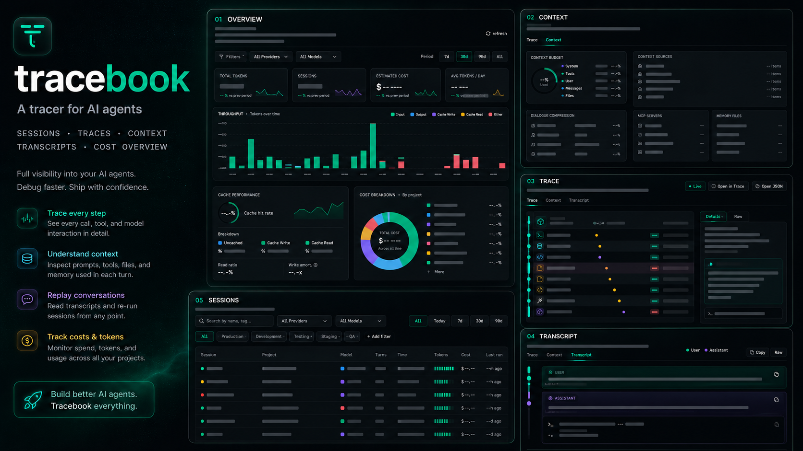

# tracebook

Panel de control local para sesiones de Claude Code (y otros agentes CLI).  
Lee archivos JSONL de sesiones de agentes y los muestra en un panel rápido y legible.

```bash
$ uv run tracebook
tracebook · http://127.0.0.1:4178
watching ~/.claude/projects · 684 sesiones indexadas
```



## Qué hace

- **Descubre** sesiones desde `~/.claude/projects/**/*.jsonl`.
- **Analiza** los mensajes del usuario, turnos del asistente, llamadas a herramientas, uso de tokens y costo.
- **Agrega** tokens, costo, estadísticas de caché y resúmenes por proyecto.
- **Monitorea** cambios en el sistema de archivos y actualiza el índice de sesiones.
- **Renderiza**:
  - Panel principal (Dashboard): tarjetas KPI, gráficos, gráfico circular por proyecto.
  - Sesiones: lista buscable/filtrable.
  - Detalle de sesión: árbol/cascada, contexto, transcripción.
  - Configuración: rutas, hooks, servidores MCP, precios.

## Qué no es

Tracebook es un **observador de solo lectura**. Nunca llama a ninguna API de modelo, nunca
enruta tokens, y nunca escribe dentro de `~/.claude/`.

Esta es la primera etapa de mi proyecto para la automatización a través de equipos de agentes. Lo
iré actualizando y gradualmente lo convertiré en una plataforma completa.

## Instalación

```bash
git clone https://github.com/AndrewK404/tracebook
cd tracebook
uv sync
uv run tracebook
```

Abre <http://127.0.0.1:4178>.

**Requisitos:** Python 3.11+, [uv](https://github.com/astral-sh/uv).

## Captura Opcional de Hooks

Tracebook también puede recibir cargas útiles (payloads) de hooks de Claude Code o Codex a través del
script `tracebook-hook`. El hook escribe eventos en
`~/.tracebook/hooks.jsonl`. Las cargas de hooks de herramientas están sanitizadas; las cargas de
solicitud de modelo se preservan bajo `model_input` para que Tracebook pueda mostrar la
solicitud exacta enviada al modelo en lugar de la reproducción reconstruida del registro.

Úsalo desde los hooks `PreToolUse`, `PostToolUse`, `PostToolBatch`, `SessionStart` o
`UserPromptSubmit`:

```json
{
  "type": "command",
  "command": "uv run --project /path/to/tracebook tracebook-hook"
}
```

Si tu ejecutor expone un hook pre-modelo, pasa uno de `model_input`,
`model_request`, `request_body`, `request`, `body`, o `messages` en el JSON del
hook. Sin ese hook, Tracebook aún reconstruye la entrada del modelo recorriendo
la transcripción hasta el segmento del modelo seleccionado.

## Stack

- Python 3.11+ · FastAPI · Jinja2 · watchdog
- React 18 + Babel-standalone + Tailwind CDN · datos renderizados en el servidor
- Solo sistema de archivos: sin base de datos, sin cola, sin nube

## Estructura

```
tracebook/
├── README.md
├── SPEC.md               especificación de producto + UX
├── ARCHITECTURE.md       mapa de componentes y flujo de datos
├── DESIGN.md             lenguaje visual
├── pyproject.toml
├── claude-design/        fuente del diseño — maquetación HTML + JSX
└── tracebook/
    ├── __main__.py
    ├── app.py            rutas de FastAPI + API JSON
    ├── store.py          índice de sesiones + caché
    ├── settings.py       rutas, puerto
    ├── pricing.py        tabla de costos por modelo
    ├── watcher.py        observador de watchdog
    ├── parsers/
    │   ├── claude.py    JSONL de Claude Code → Session tipada
    ├── templates/        plantilla base de Jinja2
    └── static/           activos CSS + JSX
```

## Recorrido Visual

### Dashboard


### Sesiones


### Trazado de sesión


### Contexto de sesión


### Transcripción de sesión


### Configuración


## Licencia

Apache 2.0.
