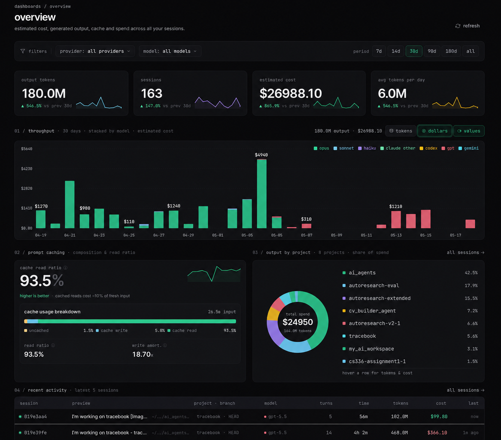
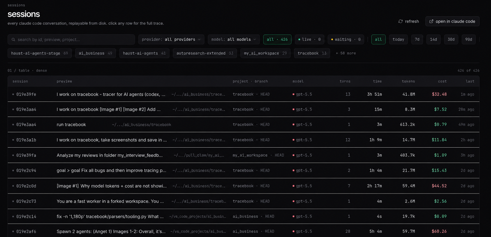
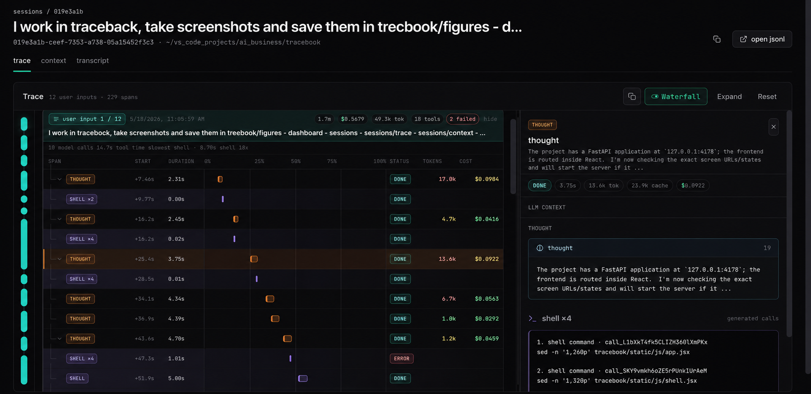
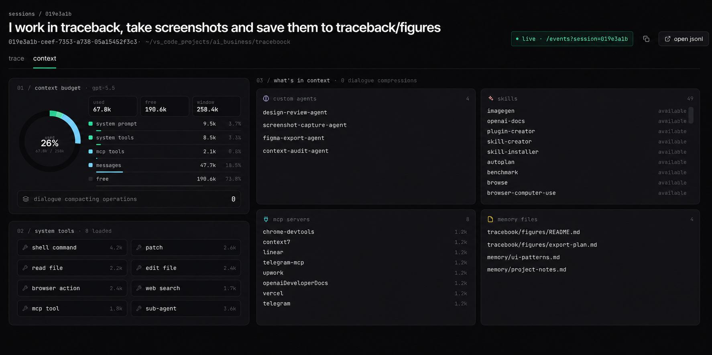
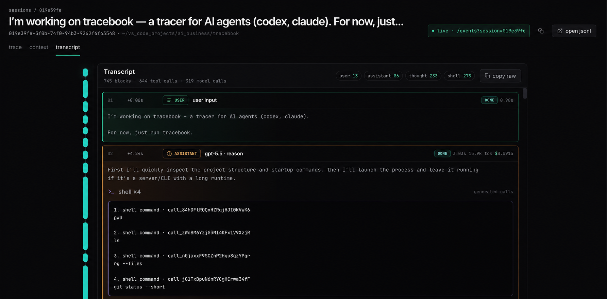
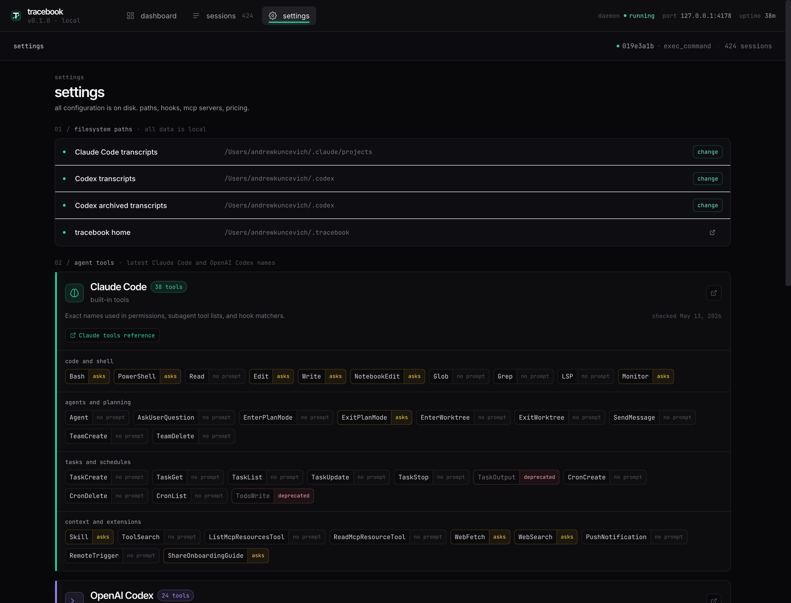

# tracebook

Local dashboard for Claude Code (and other CLI agents) sessions.  
It reads agent session JSONL files and shows them in a fast, readable dashboard.

```bash
$ uv run tracebook
tracebook · http://127.0.0.1:4178
watching ~/.claude/projects · 684 sessions indexed
```

## What it does

- **Discovers** sessions from `~/.claude/projects/**/*.jsonl`.
- **Parses** user prompts, assistant turns, tool calls, token usage and cost.
- **Aggregates** tokens, cost, cache stats, and per-project summaries.
- **Watches** filesystem changes and updates session index.
- **Renders**:
  - Dashboard: KPI cards, charts, project pie.
  - Sessions: searchable/filterable list.
  - Session detail: tree/waterfall, context, transcript.
  - Settings: paths, hooks, MCP servers, pricing.

## What it is not

Tracebook is a **read-only observer**. It never calls any model API, never
proxies tokens, and never writes inside `~/.claude/`.

This is **v0.1** of a longer roadmap that eventually grows into
[Leibniz](https://github.com/AndrewK404/leibniz-platform): MCP memory server,
workflow orchestration, approval inbox. v0.1 does one thing well: turn raw
JSONL into a useful dashboard.

## Install

```bash
git clone https://github.com/AndrewK404/tracebook
cd tracebook
uv sync
uv run tracebook
```

Open <http://127.0.0.1:4178>.

**Requirements:** Python 3.11+, [uv](https://github.com/astral-sh/uv).

## Optional Hook Capture

Tracebook can also receive Claude Code or Codex hook payloads through the
`tracebook-hook` script. The hook writes events to
`~/.tracebook/hooks.jsonl`. Tool hook payloads are sanitized; model-request
hook payloads are preserved under `model_input` so Tracebook can show the exact
request sent to the model instead of the reconstructed log replay.

Use it from `PreToolUse`, `PostToolUse`, `PostToolBatch`, `SessionStart`, or
`UserPromptSubmit` hooks:

```json
{
  "type": "command",
  "command": "uv run --project /path/to/tracebook tracebook-hook"
}
```

If your runner exposes a pre-model hook, pass one of `model_input`,
`model_request`, `request_body`, `request`, `body`, or `messages` in the hook
JSON. Without that hook Tracebook still reconstructs model input by walking the
transcript up to the selected model span.

## Stack

- Python 3.11+ · FastAPI · Jinja2 · watchdog
- React 18 + Babel-standalone + Tailwind CDN · server-rendered data
- Filesystem only — no database, no queue, no cloud

## Layout

```
tracebook/
├── README.md
├── SPEC.md               product + UX spec
├── ARCHITECTURE.md       component map and data flow
├── DESIGN.md             visual language
├── pyproject.toml
├── claude-design/        design source — HTML mockup + JSX
└── tracebook/
    ├── __main__.py
    ├── app.py            FastAPI routes + JSON API
    ├── store.py          session index + caching
    ├── settings.py       paths, port
    ├── pricing.py        model cost table
    ├── watcher.py        watchdog observer
    ├── parsers/
    │   ├── claude.py    Claude Code JSONL → typed Session
    ├── templates/        Jinja2 shell template
    └── static/           CSS + JSX assets
```

## Visual Tour

### Dashboard



### Sessions



### Session Trace



### Session Context



### Session Transcript



### Settings



## License

Apache 2.0.
